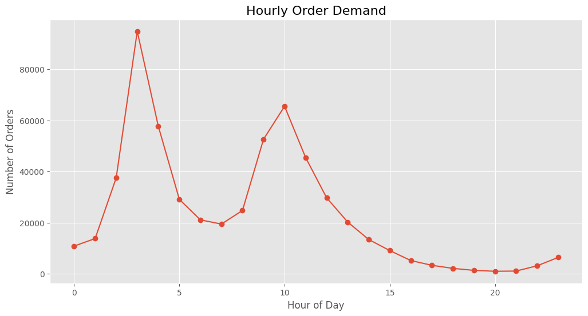
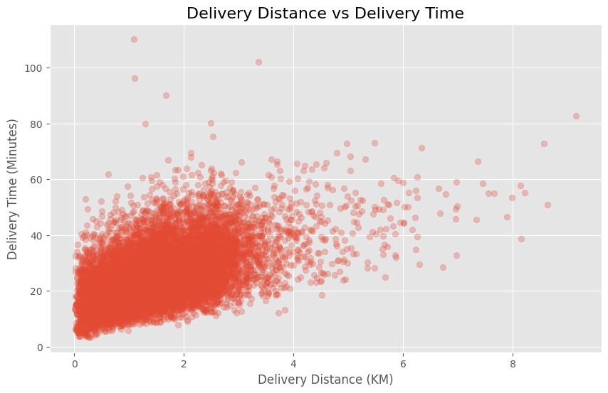
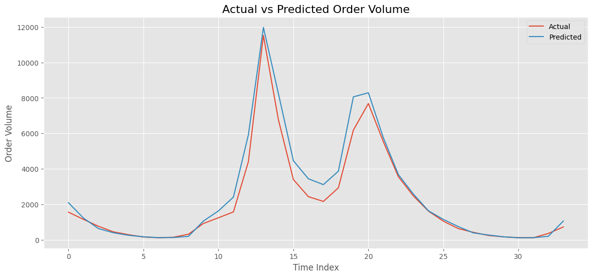
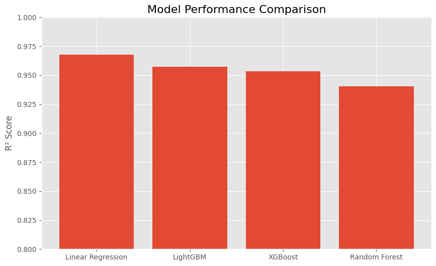
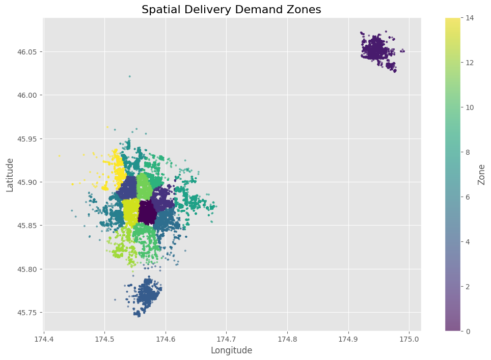
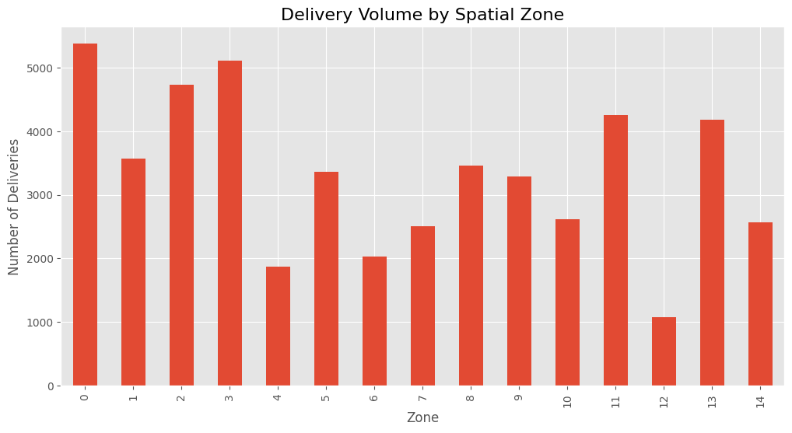

# On-Demand Delivery Demand Forecasting & Operational Analytics

Operational analytics and demand forecasting for large-scale food delivery systems using machine learning.

---

# Project Overview

This project analyzes more than 650,000 operational food delivery records from Meituan to study:

- delivery performance,
- courier workload behavior,
- temporal demand patterns,
- and hourly order forecasting.

The project combines:
- exploratory data analysis,
- geospatial analytics,
- operational KPI engineering,
- spatiotemporal demand analysis,
- and machine learning forecasting models.

---

# Dataset

Source:
Meituan Operational-Level On-Demand Food Delivery Dataset  
(INFORMS TSL Research Challenge)

Dataset includes:
- 650K+ delivery records
- courier dispatch activity
- geographic delivery coordinates
- order lifecycle timestamps
- courier wave information

---

# Tech Stack

- Python
- Pandas
- NumPy
- Matplotlib
- Scikit-learn
- XGBoost
- LightGBM
- Google Colab

---

# Key Features

## Operational Analytics
- Delivery time analysis
- Peak-hour operational behavior
- Courier workload distribution
- Dispatch delay analysis

## Geospatial Analysis
- Delivery distance calculation using Haversine formula
- Distance vs delivery time analysis
- Spatial delivery zone clustering using KMeans
- Geographic demand hotspot analysis
- Zone-level delivery density analysis

## Demand Forecasting
- Hourly order demand aggregation
- Time-series feature engineering
- Lag-based forecasting features
- Rolling average demand features

## Machine Learning Models
- Linear Regression
- Random Forest Regressor
- XGBoost Regressor
- LightGBM Regressor

---

# Model Performance

| Model | R² Score | RMSE | MAE |
|------|------|------|------|
| Linear Regression | 0.968 | 468.63 | 293.28 |
| LightGBM | 0.958 | - | - |
| XGBoost | 0.953 | - | - |
| Random Forest | 0.940 | 638.96 | 396.07 |

---

# Key Business Insights

- Most deliveries were short-distance, with a median delivery distance of approximately 1.47 km.
- Delivery demand followed highly cyclical daily operational patterns.
- Previous-day same-hour demand (`lag_24_hour`) was the strongest predictor of future order volume.
- Courier workload distribution showed operational imbalance across drivers.
- Peak-hour operations demonstrated strong system efficiency despite higher demand volume.
- Spatial clustering revealed geographically concentrated delivery hotspots and uneven delivery density across operational zones.

---

# Visualizations

## Hourly Order Demand



---

## Delivery Distance vs Delivery Time



---

## Courier Workload Distribution


---

## Actual vs Predicted Order Volume



---

## Model Performance Comparison



---
## Spatial Delivery Demand Zones



---

## Delivery Volume by Spatial Zone



---

# Repository Structure

```text
on-demand-delivery-demand-forecasting/
│
├── notebooks/
│   └── On_Demand_Delivery_Forecasting_Analytics.ipynb
│
├── project_assets/
│   ├── hourly_order_demand.png
│   ├── actual_vs_predicted.png
│   ├── model_comparison.png
│   └── ...
│
├── requirements.txt
├── .gitignore
└── README.md
